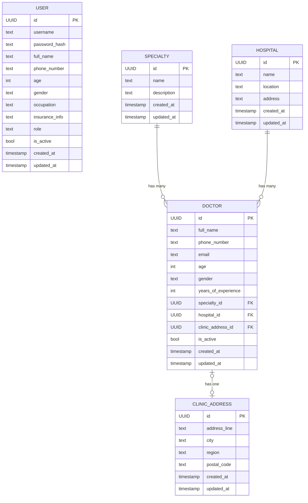

# Database Design

## Overview

This document describes the initial database structure for the Doctor Information Search Application. The design is derived from the [PRD](file:///Volumes/Data/Code/VibeCodeProject/DoctorApp/docs/product/PRD.md) and [Architecture Overview](file:///Volumes/Data/Code/VibeCodeProject/DoctorApp/docs/architecture/ArchitectureOverview.md).

PostgreSQL is the single system of record. All reads and writes go through the Django backend; no client application accesses the database directly. The schema covers the MVP scope: user accounts, the doctor directory, and administrator-managed records. Future entities (ratings, reviews, articles, messages, appointments) are noted but not modeled in detail until their governance rules are defined.

Design principles:

- **Business-entity focus** — each table represents a distinct real-world concept.
- **Normalization** — specialties, hospitals, and clinic addresses are separated to avoid duplication and to support independent search facets.
- **Extensibility** — the schema can accommodate deferred features (insurance, ratings, messaging) without restructuring core tables.
- **Auditability** — every mutable record carries created-at and updated-at timestamps to support future governance and audit requirements.

---

## Entities

### User

Represents a registered account — either a regular user (patient, healthcare consumer, caregiver) or an administrator.

#### Attributes

| Attribute          | Type      | Required | Notes                                                        |
| ------------------ | --------- | -------- | ------------------------------------------------------------ |
| id                 | UUID      | Yes      | Primary key                                                  |
| username           | Text      | Yes      | Unique; used for login                                       |
| password_hash      | Text      | Yes      | Stored as a secure hash; never stored in plain text          |
| full_name          | Text      | Yes      | Collected at registration                                    |
| phone_number       | Text      | Yes      | Collected at registration                                    |
| age                | Integer   | Yes      | Collected at registration                                    |
| gender             | Text      | Yes      | Collected at registration                                    |
| occupation         | Text      | Yes      | Collected at registration                                    |
| insurance_info     | Text      | No       | Collected only when the product defines a purpose for it     |
| role               | Text      | Yes      | Distinguishes regular users from administrators               |
| is_active          | Boolean   | Yes      | Supports soft-deletion by administrators                     |
| created_at         | Timestamp | Yes      | Record creation time                                         |
| updated_at         | Timestamp | Yes      | Last modification time                                       |

#### Relationships

- A User has one role (regular user or administrator).
- An administrator User can create, update, or delete Doctor records.
- An administrator User can view or delete other User records.

---

### Doctor

Represents a doctor in the directory. Doctor records are created and maintained exclusively by administrators.

#### Attributes

| Attribute          | Type      | Required | Notes                                                        |
| ------------------ | --------- | -------- | ------------------------------------------------------------ |
| id                 | UUID      | Yes      | Primary key                                                  |
| full_name          | Text      | Yes      | Searchable; displayed on profile                             |
| phone_number       | Text      | No       | Basic contact; shown when available                          |
| email              | Text      | No       | Basic contact; shown when available                          |
| age                | Integer   | No       | Shown when available and appropriate                         |
| gender             | Text      | No       | Shown when available and appropriate                         |
| years_of_experience| Integer   | No       | Displayed on the doctor profile                              |
| specialty_id       | UUID      | Yes      | Foreign key → Specialty; searchable                          |
| hospital_id        | UUID      | Yes      | Foreign key → Hospital; searchable                           |
| clinic_address_id  | UUID      | No       | Foreign key → ClinicAddress; displayed on profile            |
| is_active          | Boolean   | Yes      | Supports soft-deletion; inactive records excluded from search|
| created_at         | Timestamp | Yes      | Record creation time                                         |
| updated_at         | Timestamp | Yes      | Last modification time                                       |

#### Relationships

- A Doctor belongs to one Specialty.
- A Doctor belongs to one Hospital.
- A Doctor may have one ClinicAddress.

---

### Specialty

Represents a medical department or specialty (e.g., Cardiology, Pediatrics). Maintained as reference data by administrators.

#### Attributes

| Attribute   | Type      | Required | Notes                        |
| ----------- | --------- | -------- | ---------------------------- |
| id          | UUID      | Yes      | Primary key                  |
| name        | Text      | Yes      | Unique; used in search facet |
| description | Text      | No       | Optional elaboration         |
| created_at  | Timestamp | Yes      | Record creation time         |
| updated_at  | Timestamp | Yes      | Last modification time       |

#### Relationships

- A Specialty has many Doctors.

---

### Hospital

Represents a hospital or healthcare facility. Maintained as reference data by administrators.

#### Attributes

| Attribute   | Type      | Required | Notes                           |
| ----------- | --------- | -------- | ------------------------------- |
| id          | UUID      | Yes      | Primary key                     |
| name        | Text      | Yes      | Unique; used in search facet    |
| location    | Text      | Yes      | Region or area; used in search  |
| address     | Text      | No       | Full address for display        |
| created_at  | Timestamp | Yes      | Record creation time            |
| updated_at  | Timestamp | Yes      | Last modification time          |

#### Relationships

- A Hospital has many Doctors.

---

### ClinicAddress

Represents a doctor's clinic location, separated from Hospital because a doctor's clinic may differ from the hospital address.

#### Attributes

| Attribute    | Type      | Required | Notes                    |
| ------------ | --------- | -------- | ------------------------ |
| id           | UUID      | Yes      | Primary key              |
| address_line | Text      | Yes      | Street address           |
| city         | Text      | Yes      | City or district         |
| region       | Text      | No       | Province, state, or area |
| postal_code  | Text      | No       | Postal or ZIP code       |
| created_at   | Timestamp | Yes      | Record creation time     |
| updated_at   | Timestamp | Yes      | Last modification time   |

#### Relationships

- A ClinicAddress belongs to one Doctor (one-to-one).

---

## ERD Description

```
User
  PK: id (UUID)
  role: text

Specialty
  PK: id (UUID)

Hospital
  PK: id (UUID)

ClinicAddress
  PK: id (UUID)

Doctor
  PK: id (UUID)
  FK: specialty_id  → Specialty.id   (many-to-one)
  FK: hospital_id   → Hospital.id    (many-to-one)
  FK: clinic_address_id → ClinicAddress.id (one-to-one, optional)
```



---

## Indexing Considerations

Indexes should target the primary search and lookup patterns defined in the PRD.

| Index Target                  | Rationale                                                             |
| ----------------------------- | --------------------------------------------------------------------- |
| User.username (unique)        | Login lookups must be fast and enforce uniqueness                      |
| User.role                     | Admin authorization checks filter by role                             |
| Doctor.full_name              | Name-based doctor search is a primary use case                        |
| Doctor.specialty_id           | Specialty-based search is a primary use case                          |
| Doctor.hospital_id            | Hospital-based search is a primary use case                           |
| Doctor.is_active              | Every user-facing query filters out inactive records                  |
| Hospital.location             | Location or region search is a primary use case                       |
| Hospital.name                 | Hospital name search is a primary use case                            |
| Specialty.name (unique)       | Faceted search and referential integrity                              |
| Hospital.name (unique)        | Referential integrity                                                 |

Full-text or trigram indexing on Doctor.full_name and Hospital.location should be considered when search performance data justifies the additional complexity.

---

## Constraints

### Uniqueness

- User.username must be unique across all users.
- Specialty.name must be unique.
- Hospital.name must be unique within a given location, or globally if hospital names are expected to be distinct.

### Referential Integrity

- Doctor.specialty_id must reference a valid Specialty.
- Doctor.hospital_id must reference a valid Hospital.
- Doctor.clinic_address_id, when present, must reference a valid ClinicAddress.
- Deleting a Specialty or Hospital that has associated active Doctors must be prevented (restrict-on-delete).

### Required Fields

- User registration enforces: username, password, full_name, phone_number, age, gender, occupation.
- Doctor record creation enforces: full_name, specialty_id, hospital_id.
- Specialty creation enforces: name.
- Hospital creation enforces: name, location.
- ClinicAddress creation enforces: address_line, city.

### Soft Deletion

- User and Doctor records use an is_active flag rather than physical deletion, so that administrative audit trails and referential integrity are preserved.
- All user-facing queries filter on is_active = true.

### Data Protection

- password_hash must never store plain-text credentials.
- insurance_info is treated as sensitive and collected only when the product has a defined purpose for it.
- Personal information (phone_number, age, gender, occupation, insurance_info) must be protected in storage and transit as specified in the non-functional requirements.

### Business Rules

- Only users with an administrator role may create, update, or delete Doctor records.
- Only users with an administrator role may view or delete other User accounts.
- Doctor records must include enough information (full_name, specialty, hospital) to support useful search and profile viewing.
- Unavailable doctor attributes must not be presented as confirmed information; the schema supports this by allowing nullable fields.
